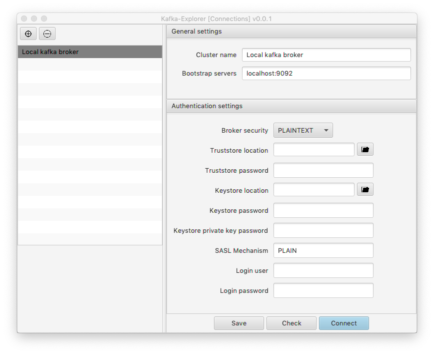
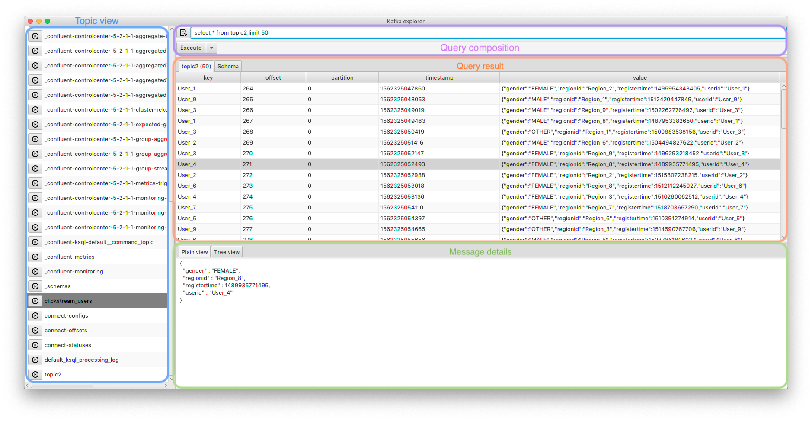
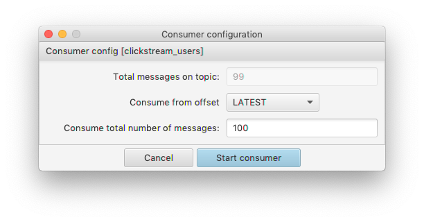
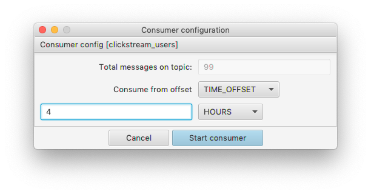
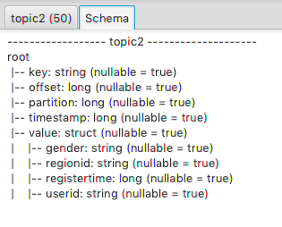
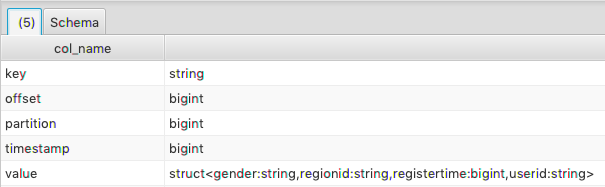

# Kafka-Browser 

Kafka browser is a desktop tool, used to query and analyse data stored on a Kafka cluster. We currently support following features:

- SQL Syntax to query for data on topics
- Generate message schema from json payload
- Consume a set of messages by
    - amount relative to offset (earliest, latest)
    - time based offset (example: last 2 days, last 10 minutes, last 5 hours)
- SQL Query history
- Join of topics 
- Easy SASL_SSL configuration
- Free!

# Table of content
1. [ Installation. ](#install)
2. [ Setup connections ](#setup)
3. [ UI Overview ](#ui-overview)
3. a) [ Consumer settings ](#consumer-settings)
4. [ Querying ](#querying)
4. a) [ Schema based queries ](#schema-base-querying)
4. b) [ Schow topic schema ](#schema-show)

<a name="install"></a>
## Installation

Download an appropriate package for your OS, install it and start.

<a name="setup"></a>
## Setup connections

The connection screen opens up as the first screen after application startup.
Enter all necessary attributes and check connectivity by pressing the "Check" button.

All made settings are stored in your home directory under ```~/.kafka-browser/connections```.



<a name="ui-overview"></a>
## UI Overview

After connecting to a particular broker, you'll get an overview of listed topics. Press on the "play" button to start a topic consumer and receive data. 



<a name="consumer-settings"></a>
### Consumer settings

To consume a kafka topic, you've got two options:

| Get X number of newest/oldest messages | Get messages based on a time period |
| ------------------------------- | ----------------------------------- |
|  |  |

<a name="querying"></a>
## Querying

To get content of a queue, you can execute a standard sql query. Some examples are:

Cast a timestamp field into a readable value:
> select value, to_utc_timestamp(to_timestamp(timestamp),  'UTC') from topic2

Join two tpics by key:
> select topic1.value from topic1, topic2 where topic2.key = topic1.key AND topic2.key = 'abc'

<a name="schema-base-querying"></a>
### Schema based queries

If your message contains a json-payload, kafka-browser will generate a schema for you automatically. You can use the schema to navigate within a message value in order to limit the output, or to filter for relevant data. For example:

> select value.user.userId from user_data limit 10

> select * from user_data where value.user.userId = 'abcdefg'

<a name="schema-show"></a>
#### Schow the schema of a topic

You've got two options to get a schema of a topic.

| Use the "Schema" tab on the query-result pane | Execute a describe schema: "describe topic" |
| --------------------------------------------- | ------------------------------------------- |
|  |  |

